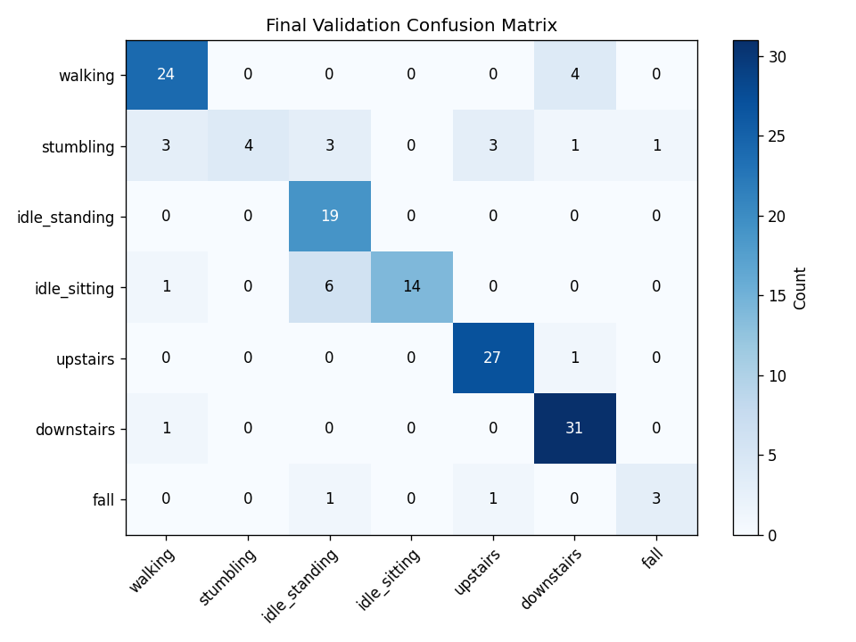
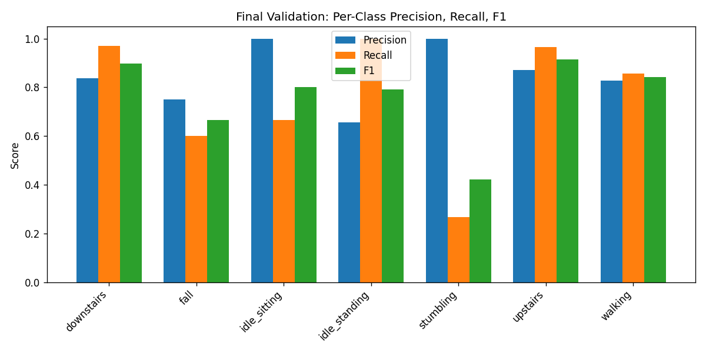
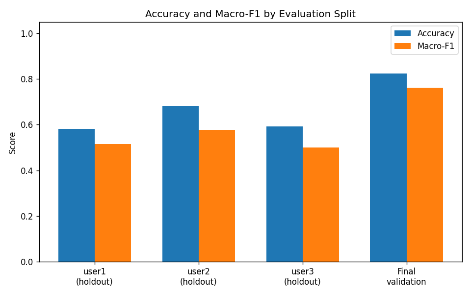
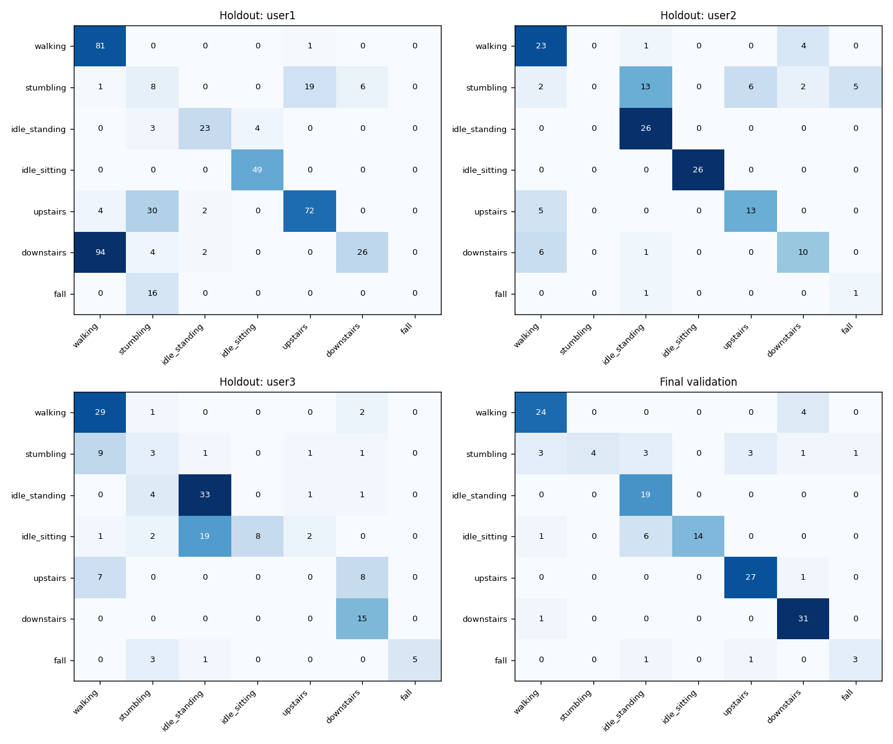
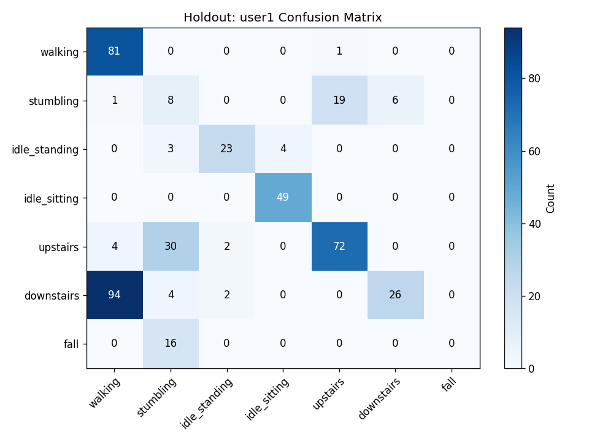
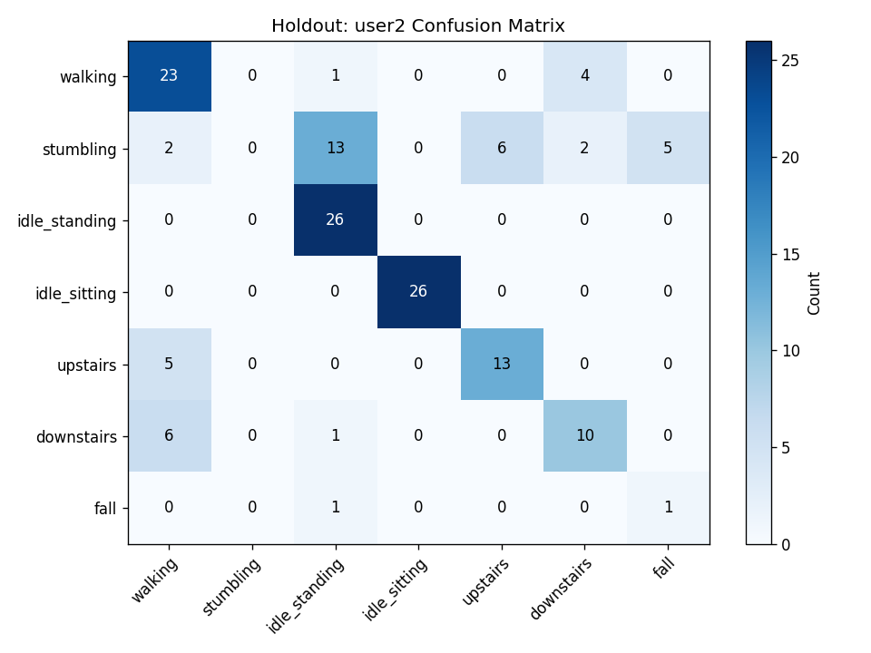
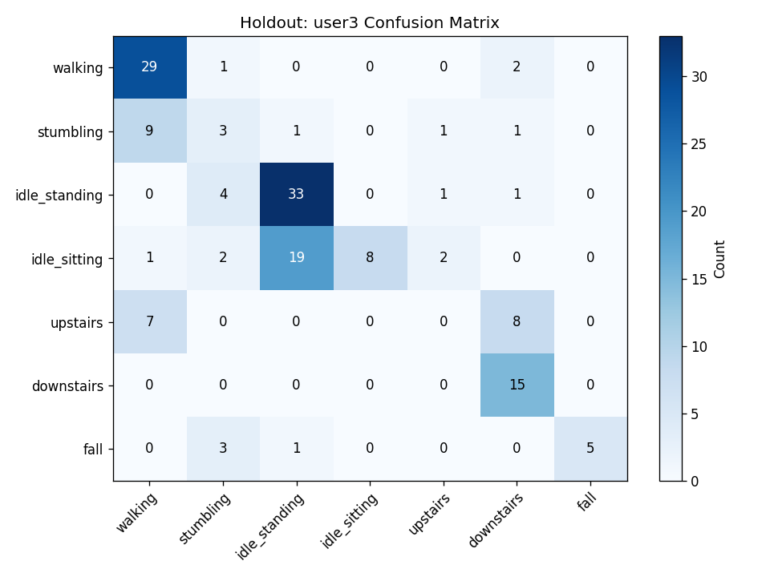

# Model Overview: TinyML Activity & Fall Detection

Waist-mounted Arduino Nano 33 BLE activity classifier for elderly-facility fall detection. Seven classes: walking, stumbling, idle_standing, idle_sitting, upstairs, downstairs, fall.

---

## Architecture

| Component | Description |
|-----------|-------------|
| **Input** | 24 statistical features from 2-second accelerometer windows (50 Hz, 100 samples) |
| **Features** | Per-axis (ax, ay, az): mean, std, min, max, range, energy. Magnitude: same 6 stats. |
| **Model** | Small MLP (16 → 8 hidden units, ReLU, dropout 0.1) |
| **Output** | 7-way softmax |
| **Deployment** | INT8 TFLite (~4.2 KB), runs on Nano 33 BLE |

---

## Dataset

- **Source**: Waist-mounted IMU recordings from 3 users
- **Users**: user1, user2, user3
- **Evaluation**: Leave-one-user-out cross-validation
- **Personalization**: Per-user walking baseline calibration (no retraining)

---

## Evaluation Results

### Summary Metrics

| Split | Accuracy | Macro-F1 |
|-------|----------|----------|
| **Final validation** | 82.43% | 0.762 |
| Fold: user1 holdout | 58.20% | 0.515 |
| Fold: user2 holdout | 68.28% | 0.577 |
| Fold: user3 holdout | 59.24% | 0.499 |

### Final Validation – Per-Class Metrics

| Class | Precision | Recall | F1 | Support |
|-------|-----------|--------|-----|---------|
| walking | 0.828 | 0.857 | 0.842 | 28 |
| stumbling | 1.000 | 0.267 | 0.421 | 15 |
| idle_standing | 0.655 | 1.000 | 0.792 | 19 |
| idle_sitting | 1.000 | 0.667 | 0.800 | 21 |
| upstairs | 0.871 | 0.964 | 0.915 | 28 |
| downstairs | 0.838 | 0.969 | 0.899 | 32 |
| fall | 0.750 | 0.600 | 0.667 | 5 |

### Leave-One-User-Out – Per-Fold Accuracy & Macro-F1

| Holdout User | Accuracy | Macro-F1 | Fall Recall |
|--------------|----------|----------|-------------|
| user1 | 58.20% | 0.515 | 0.00 |
| user2 | 68.28% | 0.577 | 0.50 |
| user3 | 59.24% | 0.499 | 0.56 |

### TFLite Deployment

| Metric | Value |
|--------|-------|
| Model size | 4,208 bytes |
| Keras/TFLite top-1 agreement | 98.44% |

---

## Graphs

Graphs are stored in `docs/model_evaluation/graphs/`.

### Final Validation

**Confusion matrix (final validation split)**



**Per-class precision, recall, and F1**



### Cross-User Evaluation

**Accuracy and macro-F1 by fold**



**Confusion matrices – all folds**



**Per-fold confusion matrices**

| user1 holdout | user2 holdout | user3 holdout |
|---------------|---------------|----------------|
|  |  |  |

---

## Known Limitations

- **Fall vs stumble**: Main weakness; user1 holdout has 0% fall recall (falls misclassified as stumbling).
- **Cross-user generalization**: Cross-user performance (leave-one-user-out) is lower than in-distribution final validation.
- **Class imbalance**: Fall has fewer samples; user2 has very few fall windows.
- **Scope**: No CNN/LSTM; no online learning or cloud dependencies.

---

## Regenerating Graphs

From the repo root:

```bash
pip install -r ml/requirements.txt
python ml/generate_evaluation_graphs.py
```

Requires `ml/artifacts/training/final_training_summary.json` from a completed training run.
